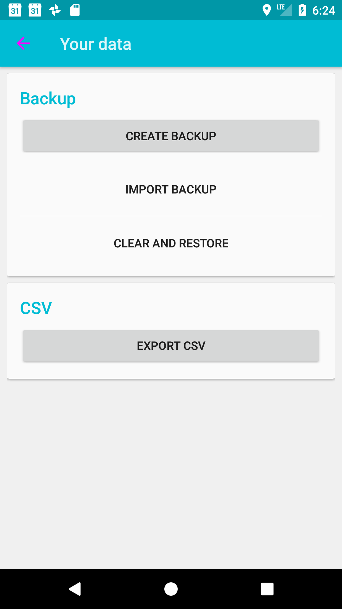
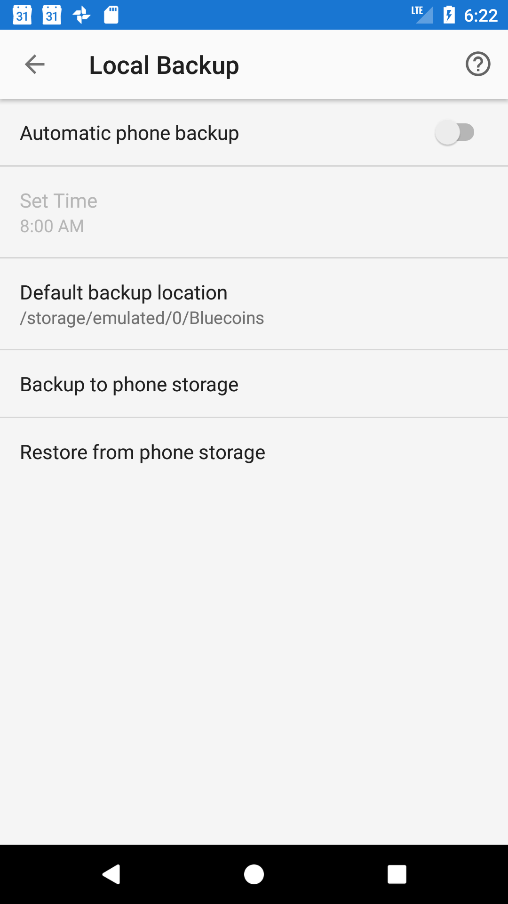

# financius2bluecoins


> Convert Financius backups to Bluecoins DBs.

This is meant to be a one-off script, so please apologize the clunky UX and
ad-hoc nature of the code. I made a lot of learnings along the way that
I would generally utilize in a later refactor, but given that it already
works for me and I've got my converted file, it's hard for me to come
up with the motivation. That said, PRs more than welcome!

## How to use

As I said, this isn't exactly optimized for ease of use.

**Step 1**

Create and download a backup from Financius.



Download the resulting JSON file and take note of its location.

**Step 2**

Prepare a barebones database in Bluecoins.

You must create accounts in the same names and currencies as in Financius. The top-level
categories don’t matter, but capitalization does. Note that existing transactions and starting
balances won’t be erased.

Also, ensure that the base currency is set correctly.

Create a local backup via “Settings > Local Backup > Backup to phone storage” and download it,
for instance via Dropbox.



**Step 3**

Build the script.

Install [stack](https://docs.haskellstack.org/en/stable/README/) either via your favorite
package manager or `curl -sSL https://get.haskellstack.org/ | sh` if you’re so inclined.

Afterwards, run `stack setup && stack build`. This may take a while.

**Step 4**

Update the ECB exchange rates.

Bluecoins saves exchange rates per transaction. Financius, however, does not. So, we pull in the
rates from the ECB, which makes them freely available. There is a bundled version that comes
with the repository, but it’s likely out of date.

```
./update-rates.sh
```

This will download a new ZIP archive.

**Step 5**

Run the script.

Now you are ready to run the script, but we have to figure out the right options first.

For example,
```
stack exec financius2bluecoin -- \
      --baseCurrency GBP \
      --financiusFile "./Financius 2017-09-30 121507.json" \
      --bluecoinFile bluecoins_workingcopy.fydb \
      --eurofxrefFile eurofxref-hist.zip
```

-	`baseCurrency` is the same as you have selected in Bluecoins. The code must match the
ones available in the `eurofxref-hist.csv`.
-	`financiusFile` points to the location where you saved the JSON file in step 1.
-	`bluecoinFile` points to the location where you saved the database in step 2. (I’m aware
of the missing “s”. PR welcome.)
-	`eurofxrefFile` points to the download ECB data from step 4. If you don’t specify this, all
exchange rates will be set to 1.0.

NOTE: This will *override to the provided `--bluecoinsFile`*.

**Step 6**

Import the file.

You can now import the generated database through “Settings > Local Backup > Restore from
phone storage”.

## Caveats

-	EUR as base currency is currently not supported. I’m a bit tired right now and not
entirely sure what would happen as it doesn’t exist as currency in the ECB CSV.
-	There will likely be conversion sum errors. For instance, you may see an account with a
real balance of USD 0, but a base currency balance of GBP 49. This is because the sum of
the currency-adjusted values doesn’t add up.

Probably a lot more. Be sure you keep your Financius backup around.

## License

BSD
